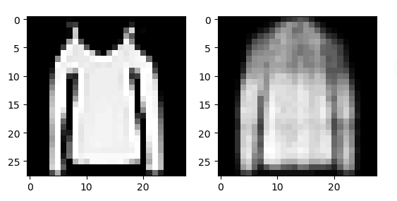
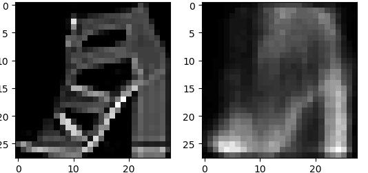
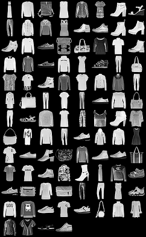
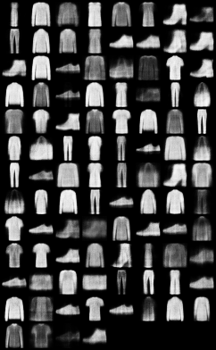
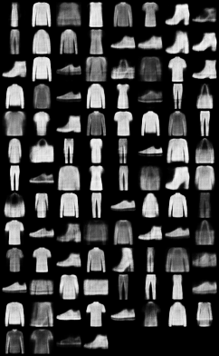
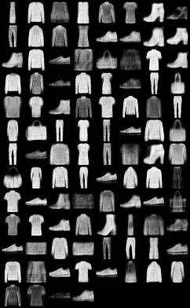
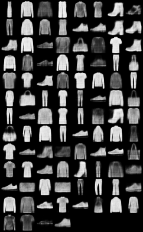

# Variational_Auto-Encoder
Variational Auto-Encoder implemented using pytorch

## About Variational_Auto-Encoder

If you already know about VAE or just want to run the code,ignore this part.

VAE is a variation of AE,so start from AE,just as first image below,it has encoder and decoder parts.
Encoder part tends to encode input image into a code,where decoder part decodes this code to try to
reconstruct raw image.


However,it has some problems.For instance,we can not change the code (latent vector) freely,because it's
provided by encoder nets.So VAE comes.It just looks like below,instead of encoding only  one vector,we use
two vectors,one represents mean,anther represents std.Then we sample from standard normal distribution,
then make real latent vector.That's why we can change latent vector in VAE.


### Loss

Loss includes two parts,one is reconstruction loss,simply can be mean square loss between raw image and reconstructed image.
Another is KL divergence between latent vector say z and standard normal distribution.

### GAN vs VAE

VAE and GAN are both generative models,they both have some advantages and disadvantages.Such as VAE can compare
raw input image and reconstruct image,but GAN can not.However GAN may has a higher resolution ratio of generated image,
because VAE does not have adversiral training.

Go to see concerned papers for more details about VAE and GAN.

## Train

### If you want to download datasets online

Run code below:

```
pip install -r requirements.txt
git clone https://github.com/cryer/Variational_Auto-Encoder.git
cd Variational_Auto-Encoder
python run_vae.py train --download=True
```
Then it will download MNIST datasets online and start to train your VAE model.To conveying a kind of directly perceived feeling,
I have made training process display in real time.Just like below:
   

* `left are real,right are fake.Notice it's FashionMNIST not MNIST,because MNIST is too old,I do not want to use them anymore,If
you want to use FashionMNIST,change code datasets.MNIST to datasets.FashionMNIST in run_vae.py`

### If you already have MNIST or FashionMNIST

However,directly download online is too slow sometimes,so you can download datasets in other ways and extract first,then put them in right path.But you also have to process them into .pb files,which are t10k-images-idx3-ubyte like files before.

How can we process them?See [official code](https://github.com/pytorch/vision/blob/master/torchvision/datasets/mnist.py),
Just refer to official implementation.

`I also provied process.py for you,just run it.`

After downloading and processing,then run code below,remember to put  data in right directory(t10k-images-idx3-ubyte in raw,.pb files in  processed).
```
pip install -r requirements.txt
git clone https://github.com/cryer/Variational_Auto-Encoder.git
cd Variational_Auto-Encoder
python run_vae.py train --download=False
```
All configs are:
```
    --train_path='data/'
    --img_size = 784
    --h_dim = 400
    --z_dim=20
    --download = True
    --batch_size=100
    --shuffle = True
    --num_workers = 2
    --lr=1e-3
    --use_gpu=True
    --epoch = 50
```

## Results
Some results below,I only trained 7 epochs,you must train longer. 

|real image    | reconstructed image epoch 1|
|:-----------:|:---------------:|
|||


|real image    | reconstructed image epoch 3|
|:-----------:|:---------------:|
|||

|real image    | reconstructed image epoch 5|
|:-----------:|:---------------:|
|||

|real image    | reconstructed image epoch 7|
|:-----------:|:---------------:|
|||

* You see details of images are not very clear yet,train more epochs on your own,suggested 50 epochs may work well.
